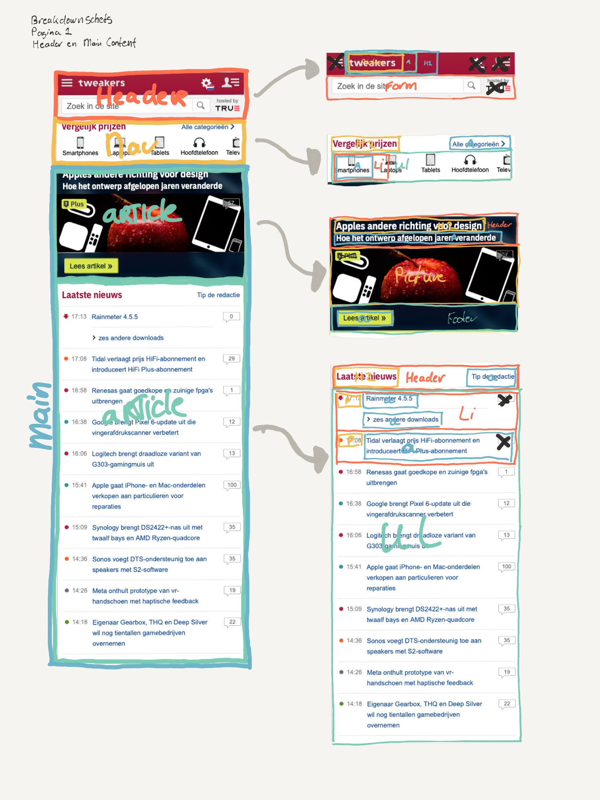

# Frontend Development 2021-2022

Dit is mijn werk voor het vak Frontend Development voor studieinhalers. In dit vak wordt de basis gelegd voor het toepassen van de basis technieken van het web.

## 📋 Opdracht

De opdracht gegeven voor dit vak luidt als volgt:

> Werk 2 verschillende pagina’s van een website uit met ‘nette’ vanilla HTML, CSS en Javascript.

Hierbij zijn wel een aantal criteria:

- Content
  - De website bevat 2 verschillende pagina’s
  - De website is gerealiseerd met ‘nette’ vanilla HTML en CSS
  - De website bevat diverse content (plaatjes, formulieren, tekst etc)
- Micro-interactie
  - de website bevat minimaal één tot in detail uitgewerkte micro-interactie (met JS)
- Toegangelijkheid
  - De website is toegankelijk
- Professionele vormgeving
  - De website heeft een professionele vormgeving (in huisstijl – css vars. voor bijvoorbeeld kleurtjes),
  - De website ziet er goed uit en werkt goed op telefoons (iPhone SE tot Galaxy Note),
  - De website is volledig responsive óf heeft een extra verzorgde surface plane.

### Website

De website die wordt 'nagemaakt' is [Tweakers](tweakers.net)

#### Pagina 1

Dit is de homepage van tweakers. Deze bestaat uit een heading en de main content, dat een verzameling links naar artikelen en andere pagina’s is

 

Pagina 1 Header en Main content

	

 

Pagina 1 Main en Footer content

	



<!--
#### Pagina 2

Pagina 2 Header en Main content

	

-->

### Breakdown Schetsen

Om te helpen met het maken van de website, zijn er breakdownschetsen gemaakt. Hiermee wordt op de screenshots aangegeven welke HTML elementen er gebruikt worden om de structuur op te bouwen

 

Pagina 1 Header en Main content

	

 

Pagina 1 Main en content

	

## Eindgesprek

### Stand van zaken

#### Document outline, section elements en headers

Door gebruikte maken van de juiste elementen kan je al heel goed voldoen aan accessibility eisen. Het artikel van CSS tricks[^1] bracht mij hierin in de goede richting. Het laat zien wat er allemaal mogelijk is.

Ik was al op de hoogte van de document outline algorithm. Hierdoor worden section elements zoals `nav`, `section`, `article` en `aside` beter benut. Zo kan je in deze elementen opnieuw beginnen met het nummeren van Headings, dus vanaf H1.

Helaas wordt dit niet ondersteund door de browser. Het artikel geeft alternatieven aan, maar is nog verbeterd door een comment van een andere gebruiker die bijvoorbeeld de post van Rachel Andrews aanhaalt[^2] waarbij wordt uitgelegd dat het voor accessibility niet goed is om de visuele order van elementen anders te laten zijn dan die van de DOM. CSS moet hier nog een oplossing voor verzinnen, voor nu is het belangrijk om op te letten wanneer je teveel met bijvoorbeeld `order` property omgaat.

Wat ik hieruit het belangrijkste vond is het gebruik van de H1. De H1 wordt bijna altijd gebruikt voor bijvoorbeeld de site titel. Op de homepage van een site, waar een overzicht staat van de website content, is dit correct. Echter een pagina van de website, bijvoorbeeld pagina 2 een artikel, daar zou de titel van het artikel de H1 moeten zijn, aangezien dat de content van die pagina is.

### Screenshot(s)

hier screenshot(s) van je eindresultaat

[^1]: [CSS Tricks - How to section your HTML](https://css-tricks.com/how-to-section-your-html/)

[^2] [Grid-content reordering and accessibility](https://rachelandrew.co.uk/archives/2019/06/04/grid-content-re-ordering-and-accessibility/)
